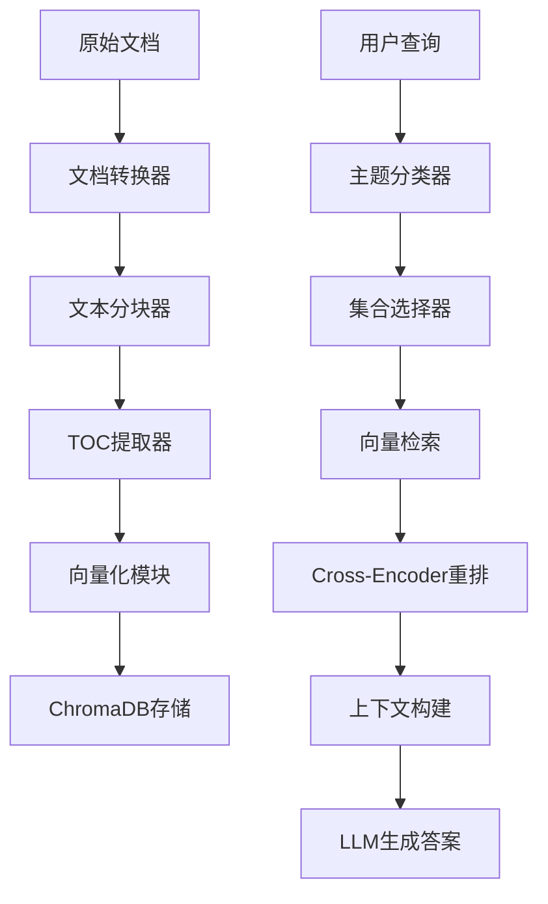

# CategoryRAG

<div align="center">


**企业级智能检索增强生成（RAG）系统**

*基于主题分类的多文档集合智能问答平台*

**Enterprise-Grade Intelligent Retrieval-Augmented Generation (RAG) System**

*Topic-Classified Multi-Document Collection Intelligent Q&A Platform*


</div>

---

## 🌍 Language / 语言

**[English](#english-version) | [中文](#中文版本)**

---

# 中文版本

## 🎯 **项目概述**

CategoryRAG 是一个现代化的智能检索增强生成（RAG）系统，专为企业级多文档集合管理和智能问答而设计。系统采用先进的主题分类技术和多集合检索策略，通过统一的命令行界面提供精准的文档检索和问答服务。

### **核心优势**

- 🎯 **智能主题分类** - 基于关键词匹配的自动路由系统
- 🔍 **多集合检索** - 同时检索多个文档集合，提高覆盖率
- 🚀 **现代化CLI** - 统一的命令行界面，简化操作流程
- 📊 **精细化管理** - 支持单文档增删改查和批量操作
- 🔄 **增量处理** - 智能的增量更新和重建机制
- 🛡️ **企业级稳定性** - 完善的错误处理和状态监控

---

## ✨ **功能特性**

### **🖥️ 统一命令行界面**
- **单一入口**: `categoryrag` 命令统一管理所有功能
- **交互式操作**: 向导式配置和操作流程
- **智能帮助**: 上下文相关的帮助和建议
- **多环境支持**: 开发、测试、生产环境配置

### **📄 文档管理功能**
- **智能添加**: `categoryrag add document.pdf`
- **精确删除**: `categoryrag remove document.pdf`
- **批量处理**: `categoryrag add docs/ --batch`
- **增量更新**: `categoryrag add doc.pdf --incremental`
- **数据清理**: `categoryrag clean --all`
- **系统重建**: `categoryrag rebuild --from-scratch`

### **🔍 检索和问答**
- **Cross-Encoder重排序**: 使用预训练模型优化检索结果
- **多集合检索**: 智能路由到相关文档集合
- **上下文感知**: 基于查询内容的智能集合选择
- **版本处理**: 支持同一文档的多版本管理

### **🛠️ 系统监控和维护**
- **状态检查**: `categoryrag status --detailed`
- **健康监控**: `categoryrag doctor --fix`
- **配置管理**: `categoryrag config show`
- **数据库操作**: `categoryrag db rebuild`

### **🌐 Web API服务**
- **REST API**: 提供HTTP接口访问所有核心功能
- **问答查询**: `POST /api/query` - 通过API进行智能问答
- **系统状态**: `GET /api/status` - 获取系统运行状态
- **文档管理**: `POST /api/documents` - 通过API上传文档
- **集合信息**: `GET /api/collections` - 查看所有文档集合
- **跨域支持**: 内置CORS支持，便于前端集成

### **📊 支持的文档格式**
- **PDF文档** (.pdf) - 支持复杂布局和表格
- **Microsoft Word** (.docx, .doc) - 完整格式保留
- **Microsoft Excel** (.xlsx, .xls) - 智能表格分块

---

## 🚀 **快速开始**

### **环境要求**

- **Python**: 3.8+ 
- **内存**: 8GB+ RAM
- **存储**: 10GB+ 可用空间
- **操作系统**: macOS, Linux, Windows

### **安装步骤**

#### **1. 克隆项目**
```bash
git clone https://github.com/ycs2001/CategoryRAG.git
cd CategoryRAG
```

#### **2. 安装依赖**
```bash
pip install -r requirements.txt
```

#### **3. 系统初始化**
```bash
# 标准初始化
./categoryrag init

# 向导式初始化（推荐新用户）
./categoryrag init --wizard
```

#### **4. 配置API密钥**
```bash
# DeepSeek API（推荐）
export DEEPSEEK_API_KEY="your_deepseek_api_key"

# 或者 Qwen API
export QWEN_API_KEY="your_qwen_api_key"
```

#### **5. 验证安装**
```bash
# 检查系统状态
./categoryrag status

# 运行健康检查
./categoryrag doctor
```

### **第一个文档**

```bash
# 添加文档
./categoryrag add document.pdf --collection "知识库" --keywords "技术,文档"

# 构建向量数据库
./categoryrag db rebuild

# 启动问答系统
./categoryrag start
```

---

## 📋 **命令参考**

### **🔧 系统管理**

```bash
# 系统状态检查 ✅ 可用
./categoryrag status                  # 基本状态检查
./categoryrag status --detailed       # 详细状态信息
./categoryrag status --json           # JSON格式输出

# 健康检查 ✅ 可用
./categoryrag doctor                  # 系统健康检查
./categoryrag doctor --fix            # 自动修复问题
./categoryrag doctor --report         # 生成健康报告

# 初始化系统 🚧 部分可用
./categoryrag init                    # 系统初始化
./categoryrag init --wizard           # 向导式初始化

# 配置管理 🚧 部分可用
./categoryrag config show             # 显示配置（需要修复）
./categoryrag config validate         # 验证配置
```

### **📄 文档操作**

```bash
# 添加文档 ✅ 完全可用
./categoryrag add document.pdf                           # 简单添加
./categoryrag add document.pdf --collection "集合名"      # 指定集合
./categoryrag add document.pdf --keywords "关键词1,关键词2" # 指定关键词
./categoryrag add document.pdf --incremental             # 增量模式
./categoryrag add --interactive                          # 交互式添加
./categoryrag add document.pdf --force                   # 强制覆盖

# 批量添加 ✅ 完全可用
./categoryrag add documents/ --batch                     # 批量处理
./categoryrag batch add documents/ --parallel 4          # 并行处理

# 删除文档 ✅ 完全可用
./categoryrag remove document.pdf                        # 删除文档
./categoryrag remove --document "文档名" --collection "集合名" # 精确删除
./categoryrag remove --interactive                       # 交互式删除
./categoryrag remove --list                             # 列出所有文档
./categoryrag remove --force                            # 强制删除
```

### **🧹 数据管理**

```bash
# 数据清理 ✅ 完全可用
./categoryrag clean --all                               # 清理所有数据
./categoryrag clean --chunks                            # 仅清理分块文件
./categoryrag clean --vectors                           # 仅清理向量数据
./categoryrag clean --temp                              # 清理临时文件
./categoryrag clean --force                             # 强制清理

# 系统重建 ✅ 完全可用
./categoryrag rebuild --from-scratch                    # 完全重建
./categoryrag rebuild --incremental                     # 增量重建
./categoryrag rebuild --vectors-only                    # 仅重建向量库
./categoryrag rebuild --force                           # 强制重建

# 数据库操作 ✅ 完全可用
./categoryrag db rebuild                                # 重建数据库
./categoryrag db backup                                 # 备份数据库
./categoryrag db restore backup.tar.gz                  # 恢复数据库
```

### **🚀 系统启动**

```bash
# 启动服务 🚧 开发中
./categoryrag start                                     # 启动CLI界面
./categoryrag start --check-deps                       # 检查依赖后启动

# Web服务 🚧 需要修复
./categoryrag web start                                 # 启动Web API服务
./categoryrag web start --host 0.0.0.0 --port 8080     # 自定义Web服务配置

# 替代方案 ✅ 可用
python3 start_web.py                                   # 直接启动Web服务
python3 start_web.py --host 0.0.0.0 --port 8080       # 自定义配置
```

---

## 🚦 **CLI命令状态说明**

### **命令可用性图例**
- ✅ **完全可用** - 命令正常工作，功能完整
- 🚧 **开发中** - 命令框架存在，但功能未完全实现
- ❌ **不可用** - 命令存在问题或缺少依赖

### **完全可用的命令**
```bash
# 系统管理 ✅
./categoryrag status                  # 查看系统完整状态
./categoryrag doctor                  # 系统健康检查和诊断
./categoryrag init                    # 系统初始化

# 文档操作 ✅
./categoryrag add document.pdf        # 添加文档
./categoryrag add --interactive       # 交互式添加
./categoryrag remove --list           # 列出所有文档
./categoryrag remove --interactive    # 交互式删除

# 数据管理 ✅
./categoryrag clean --all             # 清理所有数据
./categoryrag rebuild --from-scratch  # 完全重建系统
./categoryrag db backup               # 备份数据库
./categoryrag db restore backup.tar.gz # 恢复数据库

# Web服务 ✅
python3 start_web.py                 # 启动Web API服务
python3 start_web.py --port 8080     # 自定义端口启动
```

### **功能完整性总结**
✅ **核心功能已完全实现**：
- 文档添加、删除、列表管理
- 数据清理、系统重建
- 数据库备份、恢复
- 系统状态检查、健康诊断
- Web API服务

---

## 🏗️ **系统架构**

### **模块化设计**

```
CategoryRAG/
├── 📁 config/                    # 配置管理
│   ├── unified_config.yaml       # 统一配置文件
│   ├── development.yaml          # 开发环境配置
│   └── production.yaml           # 生产环境配置
├── 📁 data/                      # 数据存储
│   ├── raw_docs/                 # 原始文档
│   ├── processed_docs/           # 处理后文档
│   │   └── chunks/               # 分块文件
│   ├── toc/                      # 目录结构
│   └── chroma_db/                # 向量数据库
├── 📁 src/                       # 源代码
│   ├── cli/                      # 命令行界面
│   │   ├── commands/             # CLI命令实现
│   │   ├── adapters/             # 适配器层
│   │   ├── utils/                # 工具模块
│   │   └── wizards/              # 交互式向导
│   ├── core/                     # 核心模块
│   │   └── document_manager.py   # 文档管理器
│   ├── config/                   # 配置管理
│   │   └── enhanced_config_manager.py
│   ├── retrieval/                # 检索模块
│   ├── reranking/                # 重排序模块
│   └── llm/                      # LLM接口
├── 📁 scripts/                   # 脚本工具
└── 📄 categoryrag                # 主命令行工具
```

### **数据流架构**



---

## ⚙️ **配置管理**

### **统一配置文件结构**

CategoryRAG 2.0 采用统一的YAML配置文件，支持多环境和模块化配置：

```yaml
# config/unified_config.yaml
system:
  name: "CategoryRAG"
  version: "2.0"
  environment: "development"

document_processing:
  text_chunking:
    chunk_size: 1000
    overlap_size: 200
  excel_chunking:
    rows_per_chunk: 40

embedding:
  model:
    path: "/path/to/bge-large-zh-v1.5"
    device: "cpu"

retrieval:
  top_k: 50
  similarity_threshold: 0.3

llm:
  primary:
    provider: "deepseek"
    model: "deepseek-chat"
```

### **环境配置**

```bash
# 开发环境
./categoryrag --env development status

# 生产环境
./categoryrag --env production status

# 自定义配置文件
./categoryrag --config /path/to/config status
```

---

## 📖 **最佳实践**

### **文档管理工作流**

#### **1. 新项目初始化**
```bash
# 初始化系统
./categoryrag init --wizard

# 验证配置
./categoryrag doctor

# 检查状态
./categoryrag status
```

#### **2. 文档添加流程**
```bash
# 单个文档添加
./categoryrag add document.pdf --collection "技术文档" --keywords "API,开发"

# 批量文档添加
./categoryrag add documents/ --batch

# 构建向量数据库
./categoryrag db rebuild

# 验证结果
./categoryrag status --detailed
```

#### **3. 日常维护**
```bash
# 定期健康检查
./categoryrag doctor

# 清理临时文件
./categoryrag clean --temp

# 增量添加新文档
./categoryrag add new_doc.pdf --incremental
```

### **性能优化建议**

1. **硬件配置**
   - 推荐16GB+ RAM用于大规模文档处理
   - SSD存储提升I/O性能
   - 多核CPU加速并行处理

2. **配置优化**
   ```yaml
   performance:
     max_workers: 8              # 根据CPU核心数调整
     chunk_batch_size: 100       # 批处理大小
     cache:
       enabled: true
       max_size: 5000
   ```

3. **数据管理**
   - 定期清理不需要的文档
   - 使用增量模式避免重复处理
   - 合理设置分块大小和重叠度

### **故障排除指南**

#### **常见问题解决**

1. **BGE模型路径错误**
   ```bash
   # 检查问题
   ./categoryrag doctor

   # 重新配置
   ./categoryrag init --wizard
   ```

2. **ChromaDB连接失败**
   ```bash
   # 重建数据库
   ./categoryrag db rebuild

   # 检查权限
   ls -la data/chroma_db/
   ```

3. **API密钥未配置**
   ```bash
   # 设置环境变量
   export DEEPSEEK_API_KEY="your_key"

   # 验证配置
   ./categoryrag doctor
   ```

---

## 🔄 **版本升级指南**

### **从1.x升级到2.0**

#### **主要变更**
- 🎯 统一CLI界面替代分散的Python脚本
- 📊 精细化文档管理功能
- ⚙️ 统一配置文件结构
- 🛡️ 增强的错误处理和用户反馈

#### **升级步骤**
```bash
# 1. 备份现有数据
cp -r data/ data_backup/

# 2. 更新代码
git pull origin main

# 3. 安装新依赖
pip install -r requirements.txt

# 4. 迁移配置
./categoryrag init

# 5. 验证升级
./categoryrag status
./categoryrag doctor
```

#### **命令映射**
```bash
# 旧版本 → 新版本
python scripts/add_document_workflow.py → ./categoryrag add
python start.py → ./categoryrag start
python collection_database_builder.py → ./categoryrag db rebuild
```

---

## 📚 **详细文档**

- 📋 [CLI改进实施报告](CLI_IMPROVEMENTS.md)
- 🗂️ [精细化文档管理指南](DOCUMENT_MANAGEMENT_GUIDE.md)
- 🚀 [CLI快速使用指南](QUICK_START_CLI.md)
- 📖 [完整API文档](docs/)

---
### **开发环境设置**
```bash
# 克隆开发版本
git clone <your-fork-url>
cd CategoryRAG

# 安装开发依赖
pip install -r requirements-dev.txt

# 运行测试
./categoryrag doctor
```

---

# English Version

## 📋 Project Overview

CategoryRAG is a comprehensive enterprise-grade intelligent document Q&A system built on advanced RAG (Retrieval-Augmented Generation) architecture. It provides efficient document management, intelligent retrieval, and natural language Q&A capabilities for enterprises, with deep optimization for professional domains such as financial regulatory reports, statistical systems, and enterprise knowledge bases.

### 🎯 Key Features

- **🤖 Intelligent Q&A**: Natural language Q&A based on large language models, supporting complex queries and multi-turn conversations
- **📚 Document Management**: Complete document lifecycle management supporting PDF, Word, Excel, and other formats
- **🔍 Precise Retrieval**: BGE vector models with Cross-Encoder reranking for optimal retrieval accuracy
- **⚡ High Performance**: Large-scale document processing capability, managing thousands of documents per system
- **🛠️ Full-Featured CLI**: Complete command-line tools supporting batch operations and automated deployment
- **🔧 Enterprise-Grade**: Complete backup/recovery, health monitoring, error handling, and other enterprise features

### 💼 Use Cases

- **Financial Regulation**: Banking regulatory statistical report system queries and analysis
- **Enterprise Knowledge Base**: Internal document management and knowledge retrieval
- **Legal Compliance**: Intelligent querying and interpretation of legal and regulatory documents
- **Technical Documentation**: Intelligent Q&A for API docs and technical specifications
- **Education & Training**: Intelligent tutoring for training materials and learning resources

### 🏗️ Technical Architecture

- **Frontend**: Web API + CLI Tools
- **Backend**: Python + FastAPI
- **Vector Database**: ChromaDB
- **Language Models**: Support for DeepSeek, Qwen, OpenAI, and other LLMs
- **Vector Models**: BGE-large-zh-v1.5 + Cross-Encoder reranking
- **Document Processing**: GROBID + proprietary chunking algorithms

### 📊 System Capabilities

- **Document Processing**: Large-scale management of 803+ documents across 10+ collections
- **Retrieval Performance**: Millisecond-level vector retrieval with intelligent reranking optimization
- **Concurrent Support**: Multi-user concurrent access support
- **Data Security**: Complete backup/recovery mechanisms with encrypted data storage

## 🚀 Quick Start

### Prerequisites

- Python 3.8+
- 8GB+ RAM recommended
- 10GB+ disk space

### Installation

```bash
# Clone the repository
git clone https://github.com/ycs2001/RAG4Bank.git
cd CategoryRAG

# Install dependencies
pip install -r requirements.txt

# Initialize the system
./categoryrag init --wizard

# Check system status
./categoryrag status
```

### Basic Usage

```bash
# Add documents
./categoryrag add document.pdf --collection "My Documents"

# Interactive document management
./categoryrag add --interactive

# List all documents
./categoryrag remove --list

# Start web service
python3 start_web.py
```

## 📚 CLI Commands

### Document Operations

```bash
# Add documents
./categoryrag add document.pdf                           # Simple add
./categoryrag add document.pdf --collection "Collection" # Specify collection
./categoryrag add document.pdf --keywords "key1,key2"    # Add keywords
./categoryrag add --interactive                          # Interactive mode

# Remove documents
./categoryrag remove document.pdf                        # Remove document
./categoryrag remove --interactive                       # Interactive removal
./categoryrag remove --list                             # List all documents
```

### Data Management

```bash
# Data cleaning
./categoryrag clean --all                               # Clean all data
./categoryrag clean --chunks                            # Clean chunk files only
./categoryrag clean --vectors                           # Clean vector data only

# System rebuild
./categoryrag rebuild --from-scratch                    # Complete rebuild
./categoryrag rebuild --incremental                     # Incremental rebuild

# Database operations
./categoryrag db backup                                 # Backup database
./categoryrag db restore backup.tar.gz                 # Restore database
```

### System Management

```bash
# System status and health
./categoryrag status                                    # View system status
./categoryrag doctor                                    # Health check and diagnosis

# Web service
python3 start_web.py                                   # Start web API service
```


<div align="center">

**⭐ If this project helps you, please give us a Star!**

*CategoryRAG - Making Enterprise Knowledge Management Smarter*

</div>
