# CategoryRAG

<div align="center">


**企业级智能检索增强生成（RAG）系统**

*基于主题分类的多文档集合智能问答平台*

</div>

---

## 🎯 **项目概述**

CategoryRAG 是一个现代化的智能检索增强生成（RAG）系统，专为企业级多文档集合管理和智能问答而设计。系统采用先进的主题分类技术和多集合检索策略，通过统一的命令行界面提供精准的文档检索和问答服务。

### **核心优势**

- 🎯 **智能主题分类** - 基于关键词匹配的自动路由系统
- 🔍 **多集合检索** - 同时检索多个文档集合，提高覆盖率
- 🚀 **现代化CLI** - 统一的命令行界面，简化操作流程
- 📊 **精细化管理** - 支持单文档增删改查和批量操作
- 🔄 **增量处理** - 智能的增量更新和重建机制
- 🛡️ **企业级稳定性** - 完善的错误处理和状态监控

---

## ✨ **功能特性**

### **🖥️ 统一命令行界面**
- **单一入口**: `categoryrag` 命令统一管理所有功能
- **交互式操作**: 向导式配置和操作流程
- **智能帮助**: 上下文相关的帮助和建议
- **多环境支持**: 开发、测试、生产环境配置

### **📄 文档管理功能**
- **智能添加**: `categoryrag add document.pdf`
- **精确删除**: `categoryrag remove document.pdf`
- **批量处理**: `categoryrag add docs/ --batch`
- **增量更新**: `categoryrag add doc.pdf --incremental`
- **数据清理**: `categoryrag clean --all`
- **系统重建**: `categoryrag rebuild --from-scratch`

### **🔍 检索和问答**
- **Cross-Encoder重排序**: 使用预训练模型优化检索结果
- **多集合检索**: 智能路由到相关文档集合
- **上下文感知**: 基于查询内容的智能集合选择
- **版本处理**: 支持同一文档的多版本管理

### **🛠️ 系统监控和维护**
- **状态检查**: `categoryrag status --detailed`
- **健康监控**: `categoryrag doctor --fix`
- **配置管理**: `categoryrag config show`
- **数据库操作**: `categoryrag db rebuild`

### **🌐 Web API服务**
- **REST API**: 提供HTTP接口访问所有核心功能
- **问答查询**: `POST /api/query` - 通过API进行智能问答
- **系统状态**: `GET /api/status` - 获取系统运行状态
- **文档管理**: `POST /api/documents` - 通过API上传文档
- **集合信息**: `GET /api/collections` - 查看所有文档集合
- **跨域支持**: 内置CORS支持，便于前端集成

### **📊 支持的文档格式**
- **PDF文档** (.pdf) - 支持复杂布局和表格
- **Microsoft Word** (.docx, .doc) - 完整格式保留
- **Microsoft Excel** (.xlsx, .xls) - 智能表格分块

---

## 🚀 **快速开始**

### **环境要求**

- **Python**: 3.8+ 
- **内存**: 8GB+ RAM
- **存储**: 10GB+ 可用空间
- **操作系统**: macOS, Linux, Windows

### **安装步骤**

#### **1. 克隆项目**
```bash
git clone <repository-url>
cd CategoryRAG
```

#### **2. 安装依赖**
```bash
pip install -r requirements.txt
```

#### **3. 系统初始化**
```bash
# 标准初始化
./categoryrag init

# 向导式初始化（推荐新用户）
./categoryrag init --wizard
```

#### **4. 配置API密钥**
```bash
# DeepSeek API（推荐）
export DEEPSEEK_API_KEY="your_deepseek_api_key"

# 或者 Qwen API
export QWEN_API_KEY="your_qwen_api_key"
```

#### **5. 验证安装**
```bash
# 检查系统状态
./categoryrag status

# 运行健康检查
./categoryrag doctor
```

### **第一个文档**

```bash
# 添加文档
./categoryrag add document.pdf --collection "知识库" --keywords "技术,文档"

# 构建向量数据库
./categoryrag db rebuild

# 启动问答系统
./categoryrag start
```

---

## 📋 **命令参考**

### **🔧 系统管理**

```bash
# 初始化系统
./categoryrag init                    # 标准初始化
./categoryrag init --wizard           # 向导式初始化

# 系统状态
./categoryrag status                  # 基本状态
./categoryrag status --detailed       # 详细状态
./categoryrag status --json           # JSON格式

# 健康检查
./categoryrag doctor                  # 健康检查
./categoryrag doctor --fix            # 自动修复问题

# 配置管理
./categoryrag config show             # 显示配置
./categoryrag config validate         # 验证配置
```

### **📄 文档操作**

```bash
# 添加文档
./categoryrag add document.pdf                           # 简单添加
./categoryrag add document.pdf --collection "集合名"      # 指定集合
./categoryrag add document.pdf --keywords "关键词1,关键词2" # 指定关键词
./categoryrag add document.pdf --incremental             # 增量模式
./categoryrag add document.pdf --preview                 # 预览模式
./categoryrag add --interactive                          # 交互式添加

# 批量添加
./categoryrag add documents/ --batch                     # 批量处理
./categoryrag add documents/ --batch --parallel 4        # 并行处理

# 删除文档
./categoryrag remove document.pdf                        # 删除文档
./categoryrag remove --document "文档名" --collection "集合名" # 精确删除
./categoryrag remove --interactive                       # 交互式删除
./categoryrag remove --list                             # 列出所有文档
```

### **🧹 数据管理**

```bash
# 数据清理
./categoryrag clean --all                               # 清理所有数据
./categoryrag clean --chunks                            # 仅清理分块文件
./categoryrag clean --vectors                           # 仅清理向量数据
./categoryrag clean --temp                              # 清理临时文件

# 系统重建
./categoryrag rebuild --from-scratch                    # 完全重建
./categoryrag rebuild --incremental                     # 增量重建
./categoryrag rebuild --vectors-only                    # 仅重建向量库

# 数据库操作
./categoryrag db rebuild                                # 重建数据库
./categoryrag db backup                                 # 备份数据库
./categoryrag db restore backup.tar.gz                  # 恢复数据库
```

### **🚀 系统启动**

```bash
# 启动服务
./categoryrag start                                     # 启动CLI界面
./categoryrag start --check-deps                       # 检查依赖后启动
./categoryrag web start                                 # 启动Web API服务
./categoryrag web start --host 0.0.0.0 --port 8080     # 自定义Web服务配置

```

---

## 🏗️ **系统架构**

### **模块化设计**

```
CategoryRAG/
├── 📁 config/                    # 配置管理
│   ├── unified_config.yaml       # 统一配置文件
│   ├── development.yaml          # 开发环境配置
│   └── production.yaml           # 生产环境配置
├── 📁 data/                      # 数据存储
│   ├── raw_docs/                 # 原始文档
│   ├── processed_docs/           # 处理后文档
│   │   └── chunks/               # 分块文件
│   ├── toc/                      # 目录结构
│   └── chroma_db/                # 向量数据库
├── 📁 src/                       # 源代码
│   ├── cli/                      # 命令行界面
│   │   ├── commands/             # CLI命令实现
│   │   ├── adapters/             # 适配器层
│   │   ├── utils/                # 工具模块
│   │   └── wizards/              # 交互式向导
│   ├── core/                     # 核心模块
│   │   └── document_manager.py   # 文档管理器
│   ├── config/                   # 配置管理
│   │   └── enhanced_config_manager.py
│   ├── retrieval/                # 检索模块
│   ├── reranking/                # 重排序模块
│   └── llm/                      # LLM接口
├── 📁 scripts/                   # 脚本工具
└── 📄 categoryrag                # 主命令行工具
```

### **数据流架构**

```mermaid
graph TD
    A[原始文档] --> B[文档转换器]
    B --> C[文本分块器]
    C --> D[TOC提取器]
    D --> E[向量化模块]
    E --> F[ChromaDB存储]

    G[用户查询] --> H[主题分类器]
    H --> I[集合选择器]
    I --> J[向量检索]
    J --> K[Cross-Encoder重排]
    K --> L[上下文构建]
    L --> M[LLM生成答案]
```



---

## ⚙️ **配置管理**

### **统一配置文件结构**

CategoryRAG 2.0 采用统一的YAML配置文件，支持多环境和模块化配置：

```yaml
# config/unified_config.yaml
system:
  name: "CategoryRAG"
  version: "2.0"
  environment: "development"

document_processing:
  text_chunking:
    chunk_size: 1000
    overlap_size: 200
  excel_chunking:
    rows_per_chunk: 40

embedding:
  model:
    path: "/path/to/bge-large-zh-v1.5"
    device: "cpu"

retrieval:
  top_k: 50
  similarity_threshold: 0.3

llm:
  primary:
    provider: "deepseek"
    model: "deepseek-chat"
```

### **环境配置**

```bash
# 开发环境
./categoryrag --env development status

# 生产环境
./categoryrag --env production status

# 自定义配置文件
./categoryrag --config /path/to/config status
```

---

## 📖 **最佳实践**

### **文档管理工作流**

#### **1. 新项目初始化**
```bash
# 初始化系统
./categoryrag init --wizard

# 验证配置
./categoryrag doctor

# 检查状态
./categoryrag status
```

#### **2. 文档添加流程**
```bash
# 单个文档添加
./categoryrag add document.pdf --collection "技术文档" --keywords "API,开发"

# 批量文档添加
./categoryrag add documents/ --batch

# 构建向量数据库
./categoryrag db rebuild

# 验证结果
./categoryrag status --detailed
```

#### **3. 日常维护**
```bash
# 定期健康检查
./categoryrag doctor

# 清理临时文件
./categoryrag clean --temp

# 增量添加新文档
./categoryrag add new_doc.pdf --incremental
```

### **性能优化建议**

1. **硬件配置**
   - 推荐16GB+ RAM用于大规模文档处理
   - SSD存储提升I/O性能
   - 多核CPU加速并行处理

2. **配置优化**
   ```yaml
   performance:
     max_workers: 8              # 根据CPU核心数调整
     chunk_batch_size: 100       # 批处理大小
     cache:
       enabled: true
       max_size: 5000
   ```

3. **数据管理**
   - 定期清理不需要的文档
   - 使用增量模式避免重复处理
   - 合理设置分块大小和重叠度

### **故障排除指南**

#### **常见问题解决**

1. **BGE模型路径错误**
   ```bash
   # 检查问题
   ./categoryrag doctor

   # 重新配置
   ./categoryrag init --wizard
   ```

2. **ChromaDB连接失败**
   ```bash
   # 重建数据库
   ./categoryrag db rebuild

   # 检查权限
   ls -la data/chroma_db/
   ```

3. **API密钥未配置**
   ```bash
   # 设置环境变量
   export DEEPSEEK_API_KEY="your_key"

   # 验证配置
   ./categoryrag doctor
   ```

---

## 🔄 **版本升级指南**

### **从1.x升级到2.0**

#### **主要变更**
- 🎯 统一CLI界面替代分散的Python脚本
- 📊 精细化文档管理功能
- ⚙️ 统一配置文件结构
- 🛡️ 增强的错误处理和用户反馈

#### **升级步骤**
```bash
# 1. 备份现有数据
cp -r data/ data_backup/

# 2. 更新代码
git pull origin main

# 3. 安装新依赖
pip install -r requirements.txt

# 4. 迁移配置
./categoryrag init

# 5. 验证升级
./categoryrag status
./categoryrag doctor
```

#### **命令映射**
```bash
# 旧版本 → 新版本
python scripts/add_document_workflow.py → ./categoryrag add
python start.py → ./categoryrag start
python collection_database_builder.py → ./categoryrag db rebuild
```

---

## 📚 **详细文档**

- 📋 [CLI改进实施报告](CLI_IMPROVEMENTS.md)
- 🗂️ [精细化文档管理指南](DOCUMENT_MANAGEMENT_GUIDE.md)
- 🚀 [CLI快速使用指南](QUICK_START_CLI.md)
- 📖 [完整API文档](docs/)

---

## 🤝 **贡献指南**

我们欢迎社区贡献！请遵循以下步骤：

1. **Fork项目** 并创建功能分支
2. **编写代码** 并添加测试
3. **运行测试** 确保所有功能正常
4. **提交PR** 并描述变更内容

### **开发环境设置**
```bash
# 克隆开发版本
git clone <your-fork-url>
cd CategoryRAG

# 安装开发依赖
pip install -r requirements-dev.txt

# 运行测试
./categoryrag doctor
```

---

## 📄 **许可证**

本项目采用 MIT 许可证 - 详见 [LICENSE](LICENSE) 文件。

---

## 📞 **支持和联系**

- 📧 **邮箱**: [support@categoryrag.com]
- 🐛 **问题反馈**: [GitHub Issues](https://github.com/your-org/CategoryRAG/issues)
- 📖 **文档**: [完整文档](https://docs.categoryrag.com)
- 💬 **社区**: [讨论区](https://github.com/your-org/CategoryRAG/discussions)

---

<div align="center">

**⭐ 如果这个项目对您有帮助，请给我们一个Star！**

*CategoryRAG - 让企业知识管理更智能*

</div>
